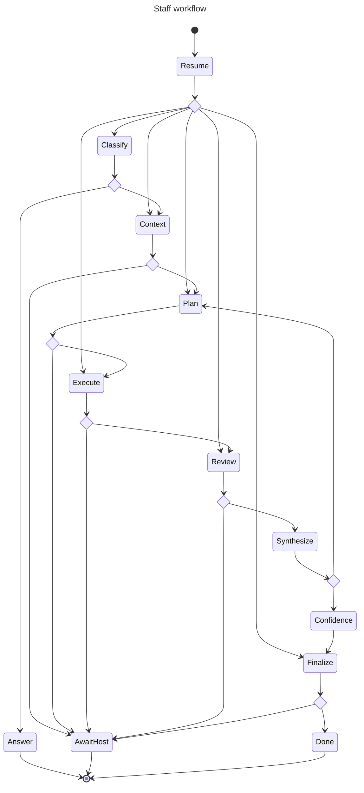

# Staff workflow

Generated from `staff_graph.py` using Pydantic Graph. `AwaitHost` saves a pending action and returns to the current chat. `Resume` continues its saved phase when the matching action result arrives. `Answer` and `Done` complete the invocation. Ordinary messages bypass this graph.

